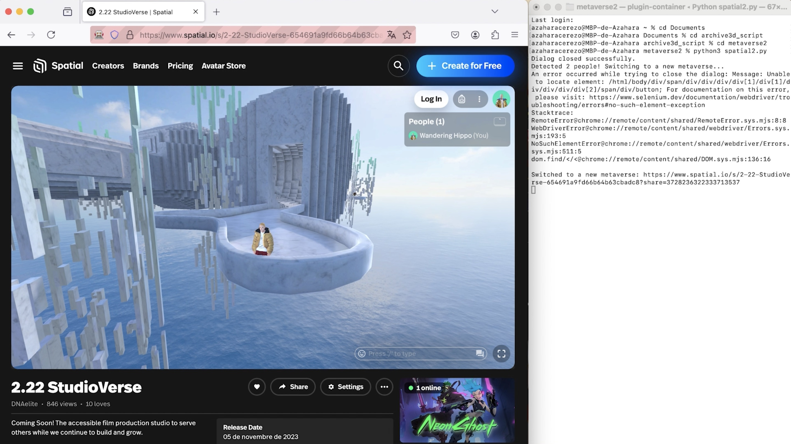

# 🛸 Metaverse Auto-Switcher

A Python script that randomly connects to different metaverses on the Spatial.io platform. 

The script automatically switches to another metaverse when it detects more than one user in the current space. 

Additionally, it closes any introductory dialogs that appear shortly after loading the space.

The script utilizes Selenium to interact with the web interface, enabling automatic navigation and user monitoring. 

## 🎮 Features

    Random Metaverse Switching: The script connects to different metaverses and switches between them when it detects multiple users in the space.
    Dialog Auto-Closing: Automatically closes the introductory dialog after a few seconds to provide a smoother user experience.
    User Monitoring: Monitors the number of users in the metaverse and switches if more than one user is detected.

## 💻 Demo

[Demo](https://youtu.be/YirResQc7ak)

## ⚙️ Requirements

    Python 3
    Selenium
    Firefox WebDriver (geckodriver)

## 📝 Installation

Clone the repository:

`git clone https://github.com/yourusername/metaverse-auto-switcher.git`

Install the necessary dependencies:

`pip install selenium`

Download geckodriver (for Firefox) from [here](https://github.com/mozilla/geckodriver/releases) and place it in the appropriate directory (update the path in the script accordingly).

Run the script:

`python metaverse_auto_switcher.py`

## 🔍 How It Works

    The script connects to a metaverse URL and waits for the "People" section to become visible.
    It then checks the number of people in the space, and if there is more than one user, it switches to a new metaverse randomly chosen from a predefined list.
    The script continuously monitors user presence, switching between metaverses.

## 📝 Notes

    This project was created purely for fun and as a demonstration of how automation can interact with virtual spaces.
    The script uses hardcoded metaverse URLs. You can easily add or modify the list of URLs to suit your needs.

